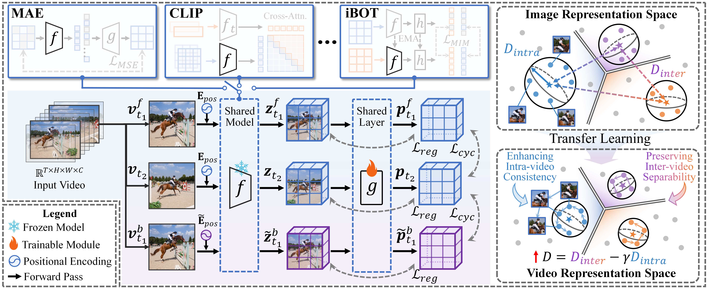

# Co-Settle
This is the official code for the paper "**From Static to Dynamic: Exploring Self-supervised Image-to-Video Representation Transfer Learning**" accepted by Conference on Computer Vision and Pattern Recognition (CVPR 2026). 

[](https://arxiv.org/abs/2603.26597) [](https://github.com/yafeng19/Co-Settle) [](https://github.com/yafeng19/Co-Settle) [](https://github.com/yafeng19/Co-Settle)

**From Static to Dynamic: Exploring Self-supervised Image-to-Video Representation Transfer Learning**

**Authors: [Yang Liu](https://yafeng19.github.io/),  [Qianqian Xu*](https://qianqianxu010.github.io/), [Peisong Wen](https://scholar.google.com.hk/citations?user=Zk2XLWYAAAAJ&hl=zh-CN&oi=ao), [Siran Dai](https://scholar.google.com.hk/citations?user=_6gw9FQAAAAJ&hl=zh-CN&oi=ao), Xilin Zhao, [Qingming Huang*](https://people.ucas.ac.cn/~qmhuang)**   



## 🚩 Checkpoints

| Model | Backbone | Dataset | Epoch | $J\\&F_m$ | mIoU | PCK@0.1 | Download |
| -------- | -------- | ----- | ---------------- | ---- | ------- | -------- | -------- |
| MAE | ViT-B/16 | INet | 800 | 52.4 | 29.3 | 41.6 | [link](https://huggingface.co/yafeng19/Co-Settle/tree/main/ckpts/base/MAE_INet_vitb16_800ep) |
| MAE **+ Ours**| ViT-B/16 | K400 | +5 | **59.6** | **33.8** | **48.4** | [link](https://huggingface.co/yafeng19/Co-Settle/tree/main/ckpts/ours/mae%2Bours) |
| I-JEPA | ViT-B/16 | INet | 800 | 53.9 | 31.5 | 42.6 | [link](https://huggingface.co/yafeng19/Co-Settle/tree/main/ckpts/base/IJEPA_INet_vitb16_800ep) |
| I-JEPA **+ Ours**| ViT-B/16 | K400 | +5 | **58.7** | **35.3** | **44.4** | [link](https://huggingface.co/yafeng19/Co-Settle/tree/main/ckpts/ours/ijepa%2Bours) |
| CLIP | ViT-B/16 | WIT | 32 | 54.9 | 38.1 | 36.9 | [link](https://huggingface.co/yafeng19/Co-Settle/tree/main/ckpts/base/CLIP_vitb16) |
| CLIP **+ Ours**| ViT-B/16 | K400 | +5 | **58.3** | **39.2** | **40.6** | [link](https://huggingface.co/yafeng19/Co-Settle/tree/main/ckpts/ours/clip%2Bours) |
| BLIP | ViT-B/16 | LAION | 20 | 58.8 | 37.6 | 35.1 | [link](https://huggingface.co/yafeng19/Co-Settle/tree/main/ckpts/base/BLIP_vitb16) |
| BLIP **+ Ours**| ViT-B/16 | K400 | +5 | **62.0** | **39.6** | **38.9** | [link](https://huggingface.co/yafeng19/Co-Settle/tree/main/ckpts/ours/blip%2Bours) |
| MoCo v3 | ViT-B/16 | INet | 300 | 62.6 | 38.8 | 43.6 | [link](https://huggingface.co/yafeng19/Co-Settle/tree/main/ckpts/base/mocov3_INet_vitb16_300ep) |
| MoCo v3 **+ Ours**| ViT-B/16 | K400 | +5 | **62.9** | **39.8** | **45.3** | [link](https://huggingface.co/yafeng19/Co-Settle/tree/main/ckpts/ours/mocov3%2Bours) |
| iBOT | ViT-B/16 | INet | 400 | 64.6 | 39.6 | 45.7 | [link](https://huggingface.co/yafeng19/Co-Settle/tree/main/ckpts/base/iBot_INet_vitb16_400ep) |
| iBOT **+ Ours**| ViT-B/16 | K400 | +5 | **65.1** | **40.8** | **46.1** | [link](https://huggingface.co/yafeng19/Co-Settle/tree/main/ckpts/ours/ibot%2Bours) |
| DINO | ViT-B/16 | INet | 300 | 63.2 | 39.1 | 44.4 | [link](https://huggingface.co/yafeng19/Co-Settle/tree/main/ckpts/base/DINO_vitb16) |
| DINO **+ Ours**| ViT-B/16 | K400 | +5 | **64.2** | **39.8** | **46.2** | [link](https://huggingface.co/yafeng19/Co-Settle/tree/main/ckpts/ours/dino%2Bours) |
| DINO v2 | ViT-B/16 | INet | 100 | 63.1 | 38.4 | 46.6 | [link](https://huggingface.co/yafeng19/Co-Settle/tree/main/ckpts/base/DINOv2_INet_vitb16_100ep) |
| DINO v2 **+ Ours**| ViT-B/16 | K400 | +5 | **63.7** | **39.9** | **47.3** | [link](https://huggingface.co/yafeng19/Co-Settle/tree/main/ckpts/ours/dinov2%2Bours) |

## 💻 Environments
* **Ubuntu** 20.04
* **CUDA** 12.4
* **Python** 3.9
* **Pytorch** 2.2.0

See `requirement.txt` for others.


## 🔧 Installation

1. Clone this repository

    ```bash
    git clone https://github.com/yafeng19/Co-Settle.git
    ```

2. Create a virtual environment with Python 3.9 and install the dependencies

    ```bash
    conda create --name Co_Settle python=3.9
    conda activate Co_Settle
    ```

3. Install the required libraries

    ```bash
    pip install -r requirements.txt
    ```


## 🚀 Training

### Dataset

1. Download Kinetics-400 dataset. 
2. Use third-party tools or scripts to extract frames from original videos.
3. Place the frames in `data/Kinetics-400/frames/train`. 
4. Integrate the frames and files into the following structure:
    ```
    Co-Settle/
    ├── data/
    │   └── Kinetics-400/
    │       └── frames/
    │           ├── train/
    │           │   ├── class_1/
    │           │   │   ├── video_1/
    │           │   │   │   ├── 00000.jpg
    │           │   │   │   ├── 00001.jpg
    │           │   │   │   ├── ...
    │           │   │   │   └── 00019.jpg
    │           │   │   ├── ...
    │           │   │   └── video_m/
    │           │   ├── ...
    │           │   └── class_n/
    │           └── val/
    │               └── ...
    ├── models/
    ├── sampling/
    ├── scripts/
    ├── util/
    └── ...
    ```

### Scripts

We provide a script with default parameters. Run the following command for training.

```bash
bash scripts/train.sh
```

## 📊 Evaluation

### Dataset

In our paper, three dense-level benchmarks are adopted for evaluation. Additional frame-level and video-level benchmarks are currently in preparation.

|  Dataset  |                          Video Task                          |                        Download link                         |
| :-------: | :----------------------------------------------------------: | :----------------------------------------------------------: |
|   DAVIS    |                 Video Object Segmentation                  | [link](https://davischallenge.org/) |
|    JHMDB    |                Human Pose Propagation                | [link](http://jhmdb.is.tue.mpg.de/) |
|  VIP  | Semantic Part Propagation | [link](https://github.com/HCPLab-SYSU/ATEN) |

### Scripts

🚧 The evaluation codes are currently under preparation and will be released soon! 🚧

## 🔬 Analysis

We provide evaluation metrics for intra-video and inter-video distances, as well as temporal cycle consistency.  To run the analysis, first randomly sample a sufficient number of videos and place the sampling list (e.g., `k400_val_1000_samples.csv`) into the `sampling/` directory. Then, execute the following command:

```bash
bash scripts/cal_metric_base.sh
bash scripts/cal_metric_ours.sh
```

## 🖋️ Citation

If you find this repository useful in your research, please cite the following papers:

```
@misc{liu2026staticdynamicexploringselfsupervised,
      title={From Static to Dynamic: Exploring Self-supervised Image-to-Video Representation Transfer Learning}, 
      author={Yang Liu and Qianqian Xu and Peisong Wen and Siran Dai and Xilin Zhao and Qingming Huang},
      year={2026},
      eprint={2603.26597},
      archivePrefix={arXiv},
      primaryClass={cs.CV},
      url={https://arxiv.org/abs/2603.26597}, 
}
```

## 📧 Contact us

If you have any detailed questions or suggestions, you can email us: liuyang232@mails.ucas.ac.cn. We will reply in 1-2 business days. Thanks for your interest in our work!

